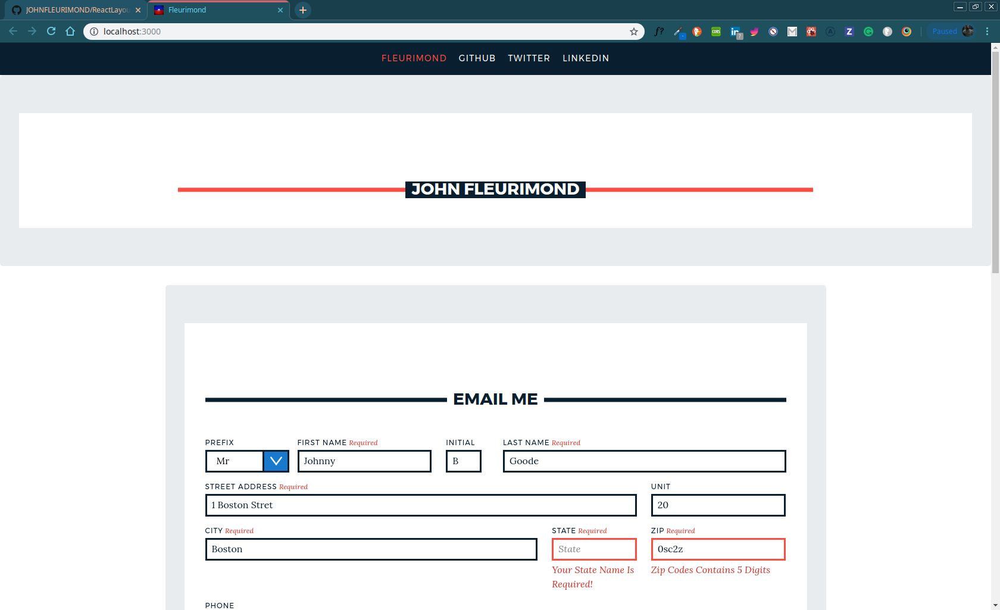

# My Awesome Project
This is a Full-Stack React Email application that allows to submit a form via Formik, Nodemailer and Axios.

## How It's Made:
This application is made with React, Formik, Axios, Bootstrap, Node, Express, and MongoDB.

## Optimizations.
This is completed, I would like to learn MySql next, I have dabbled in GraphQL, Now I want to see if I can do this with MySql 

## Lessons Learned:
How to properly use Formik, Using Axios to post that data onSubmit click of a button.
Formik had cool props like errors and touched and used correctly when set up if a field is visited (touched) when you set up your Yup for object schema validation. It has an API that's pretty similar Joi / React PropTypes and this is a complementary package Formik) when it is blurred it will display the error you created. Here is an example of the code:

With firstName being the initialValue passed thru to Formik from my higher order component I created. It now knows that that TextInput.js is a text input field that is named “firstName” and it is a string that is required and has a minimal of 2 characters, if the field is touched ( error={touched.firstName && errors.firstName} ) then blurred ( {handleBlur} ) it will display the message created in the .min function. Or touched and there was no onChange it will let you know that it is required as well.


```validationSchema={Yup.object().shape({
     firstName: Yup.string()
       .required('Your First Name Is Required!')
       .min(2, 'Your First Name Needs To Be Valid'),
   })}
```


Most importantly I learned how to set up Express and MongoDB in a file quiet quickly and setting up my package.json to have concurrently run both scripts for the backend and frontend servers.

This wasn't totally smooth though because I had issues on hitting the routes from the front end to the backend. So for anyone in the future runs into this issue, remember when you set up your server file and it opens up on lets say port http://localhost:3030/ and your React app is on http://localhost:3000/ you have to post on the front end like so ` axios .post("localhost:3030/api/form", values, actions).then(response => {console.log(response); })` Because thats where your server is listening to.

    ```onSubmit={(values, actions) => {
              setTimeout(() => {
                axios
                .post('/api/form', values, actions)
                .then(response => {
                  console.log(response);
                })
                .catch(error => {
                  console.log(error.response);
                });
                console.log({ values, actions });
                alert(JSON.stringify(values, null, 2));
                actions.setSubmitting(false);
              }, 400);
            }}
            
action="http://localhost:3030/api/form" method="POST" ```

```const express = require("express");
const cors = require("cors");
const mongoose = require("mongoose");
const bodyParser = require("body-parser");
const Exercise = require("./models/routes.model");
require("dotenv").config();
​
const PORT = process.env.PORT || 8080;
const app = express();
​
app.use(
  bodyParser.urlencoded({
    extended: true
  })
);
​
app.use(cors());
app.use(express.json());
​
const uri = process.env.ATLAS_URI;
mongoose.connect(uri, { useNewUrlParser: true, useCreateIndex: true });
const db = mongoose.connection;
db.on('error', (error) => console.error(error))
db.once("open", () => {
  console.log("MongoDB database connection established successfully");
});
​
app.use(require('./routes/routes'));
app.post("/api/form", async (req, res) => {
  const firstName =   req.body.firstName;
  const middleName =  req.body.middleName;
  const lastName =  req.body.lastName;
  const phone =  Number(req.body.phone);
```


## portfolio:
**WEBSITE:** https:/johnfleurimond.com

## Installation

1. Clone repo
2. run `npm install`

## Usage


## Available Scripts

In the project directory, you can run:

### `npm start`

Runs the app in the development mode.<br>
Open [http://localhost:3000](http://localhost:3000) to view it in the browser.

The page will reload if you make edits.<br>
You will also see any lint errors in the console.

### `npm test`

Launches the test runner in the interactive watch mode.<br>
See the section about [running tests](https://facebook.github.io/create-react-app/docs/running-tests) for more information.

### `npm run build`

Builds the app for production to the `build` folder.<br>
It correctly bundles React in production mode and optimizes the build for the best performance.

The build is minified and the filenames include the hashes.<br>
Your app is ready to be deployed!

See the section about [deployment](https://facebook.github.io/create-react-app/docs/deployment) for more information.

### `npm run eject`

**Note: this is a one-way operation. Once you `eject`, you can’t go back!**

If you aren’t satisfied with the build tool and configuration choices, you can `eject` at any time. This command will remove the single build dependency from your project.

Instead, it will copy all the configuration files and the transitive dependencies (Webpack, Babel, ESLint, etc) right into your project so you have full control over them. All of the commands except `eject` will still work, but they will point to the copied scripts so you can tweak them. At this point you’re on your own.

You don’t have to ever use `eject`. The curated feature set is suitable for small and middle deployments, and you shouldn’t feel obligated to use this feature. However we understand that this tool wouldn’t be useful if you couldn’t customize it when you are ready for it.

## Learn More

You can learn more in the [Create React App documentation](https://facebook.github.io/create-react-app/docs/getting-started).

To learn React, check out the [React documentation](https://reactjs.org/).

### Code Splitting

This section has moved here: https://facebook.github.io/create-react-app/docs/code-splitting

### Analyzing the Bundle Size

This section has moved here: https://facebook.github.io/create-react-app/docs/analyzing-the-bundle-size

### Making a Progressive Web App

This section has moved here: https://facebook.github.io/create-react-app/docs/making-a-progressive-web-app

### Advanced Configuration

This section has moved here: https://facebook.github.io/create-react-app/docs/advanced-configuration

### Deployment

This section has moved here: https://facebook.github.io/create-react-app/docs/deployment

### `npm run build` fails to minify

This section has moved here: https://facebook.github.io/create-react-app/docs/troubleshooting#npm-run-build-fails-to-minify